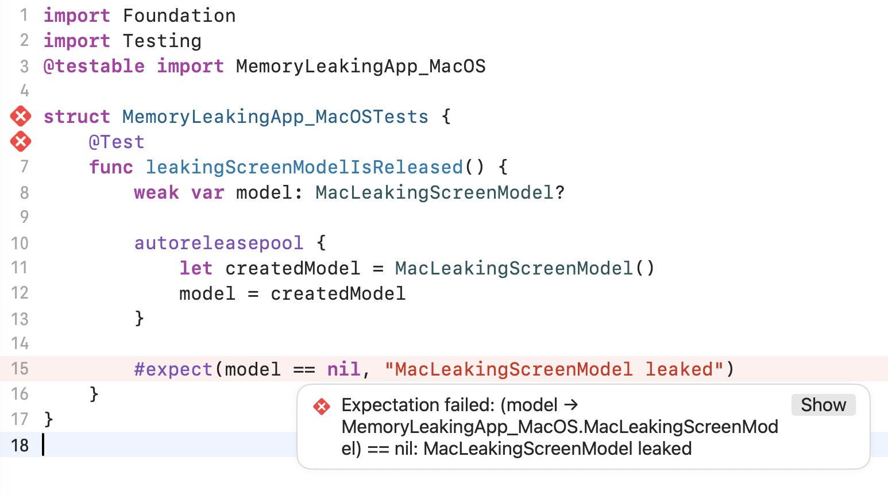

# How to use xctrace to automatically detect memory leaks


## TL;DR

The app runs with the Leaks instrument while a UI test opens and closes an important screen five times. The results are then exported. **If five copies of a screen, model, or coordinator are still in memory, that points to a leak.** Repeating the flow makes a small leak much easier to spot.

## What changed since 2019

In 2019, I wrote about [finding iOS memory leaks with UI tests](https://ondrej.macoszek.cz/blog/2019-02-27-memleaks-via-uitests/). That version ran UI tests with the `instruments` command-line tool, then used [TraceUtility](https://github.com/Qusic/TraceUtility) to read the trace.

It worked, but **reading the results was fragile**. TraceUtility relied on guessed, private Apple types to understand the trace. If Apple changed the internal format, the parser could stop working.

Apple has since replaced that workflow. [Xcode 13](https://developer.apple.com/documentation/xcode-release-notes/xcode-13-release-notes) removed `instruments` in favor of `xctrace`. The important part is that `xctrace export` can now export the Allocations and Leaks tables as XML. We can record with `xctrace record` and read the result without guessing how a `.trace` bundle works inside.

## What is a memory leak?

A memory leak happens when the app is done with an object but something still keeps it alive. The leaked object wastes memory and may also hold on to tasks, files, subscriptions, or other objects. Enough leaks can slow the app down or make the system terminate it.

This post compares two checks: a quick unit test for one type and a broader UI test that runs the real app with `xctrace`.

## At a glance

| What the check can catch | Option 1: Unit test | Option 2: UI test + xctrace |
| -------- | :---: | :---: |
| The tested object retains itself | ✅ | ✅ |
| Another object keeps the tested object alive | ✅ | ✅ |
| A related object leaks on its own | ❌ | ✅ |
| App wiring creates a retain cycle | ❌ | ✅ |
| The tested user flow triggers another app leak | ❌ | ✅ |
| Framework or system code leaks | ❌ | ✅ |

_This table shows what each check can see, not what Instruments will always report._ `xctrace` may also find leaks in system frameworks, which can add some noise outside the app code.

## Option 1: Quick unit test

The fastest option is to test one reference type directly. The object is created inside an `autoreleasepool`, while a weak reference stays outside so the test can check whether it was released.

```swift
import Foundation
import Testing
@testable import MyApp

@Test
func detailsViewModelIsReleased() {
    weak var retainedModel: DetailsViewModel?

    autoreleasepool {
        let model = DetailsViewModel()
        retainedModel = model

        model.load()
        model.selectFirstResult()
        model.cancel()
    }

    #expect(retainedModel == nil, "DetailsViewModel leaked")
}
```



Using the object is part of the check. A callback, timer, task, subscription, or delegate may start leaking only after a certain method runs. In this example, `load()`, `selectFirstResult()`, and `cancel()` cover the main paths before the release check.

One possible shortcut might be to adapt an existing unit test: its instance creation and actions could stay inside an `autoreleasepool`, with a weak reference and final release check outside. I have not tried this across an existing test suite, so for now it is only an idea.

**Pros**

- Fast enough to run with every change.
- Gives a clear failure for the type being tested.
- Easy to add when fixing a known ownership bug.

**Cons**

- Only covers the objects and behavior set up in the test.
- Can miss leaks created when the real app connects screens, models, callbacks, and routers.

## Option 2: Check the real app with xctrace

Some leaks only appear after the real app connects its screens, routers, coordinators, models, and callbacks. A UI test can perform that real flow while Instruments watches the app process.

The example repeats the flow five times. Opening and closing a details screen five times should not leave five screens, models, or coordinators in memory.

```swift
import XCTest

final class MemoryLeakUITests: XCTestCase {
    @MainActor
    func testDetailsFlowRepeatedly() {
        let app = XCUIApplication()
        app.launch()
        defer { app.terminate() }

        sleep(5) // Time for xctrace to attach.

        for iteration in 1...5 {
            app.buttons["open-details"].tap()

            let closeButton = app.buttons["close-details"]
            XCTAssertTrue(
                closeButton.waitForExistence(timeout: 10),
                "Details did not open on iteration \(iteration)"
            )
            closeButton.tap()
            XCTAssertTrue(closeButton.waitForNonExistence(timeout: 10))
        }

        sleep(5) // Time for the Leaks instrument to inspect the final state.
    }
}
```

**The UI test itself does not check memory.** It only performs the flow and makes any leak easier to see. A script starts the test, finds the app process, attaches the Leaks instrument, and saves the trace.

[Watch the macOS leak-check recording](info/option2_macos.mp4).

[Watch the iOS leak-check recording](info/option2_ios.mp4).

> **iOS device required:** In my testing, recording works on a physical device. On the Simulator, `xctrace record` hangs when it attaches to the app's internal Simulator PID. This looks like an `xctrace` or Simulator bug, but I have not confirmed the cause. If you find a workaround, [email me](mailto:ondrej@macoszek.cz). I would be glad to hear about it.

The essential recording and export commands are:

```sh
xcrun xctrace record \
  --template 'Leaks' \
  --device "$DEVICE_ID" \
  --attach "$APP_PID" \
  --output LeakRun.trace \
  --no-prompt

xcrun xctrace export \
  --input LeakRun.trace \
  --toc \
  --output LeakRun-toc.xml

xcrun xctrace export \
  --input LeakRun.trace \
  --xpath '/trace-toc/run[@number="1"]/tracks/track[@name="Leaks"]/details/detail[@name="Leaks"]' \
  --output LeakRun-leaks.xml
```

The first export reads the table of contents, which lists the available tracks and tables. The XPath then selects the Leaks table. The [`xctrace` man page](https://keith.github.io/xcode-man-pages/xctrace.1.html) lists the other recording and export options.

The exported XML is simple enough to check in a script. When that check fails, **keeping both the XML and the `.trace` bundle as CI artifacts** leaves the full trace available to open in Instruments and investigate.

**Pros**

- Runs against the real app and its actual object wiring.
- Finds leaks caused by navigation and common user flows.
- Can catch leaks outside the starting screen or type.

**Cons**

- Takes more work to set up and debug.
- Runs much slower than a unit test.
- May include leaks from frameworks or system code outside the app's control.

**Option 1 is cheap enough to run often.** The slower **Option 2 may fit better in a nightly or occasional CI job**.

## Example project

The example project includes iOS and macOS apps, unit tests, repeated UI tests, a reusable recording script, a small XML checker, and a smaller Leaks trace template. It shows one leak inside a model and another that appears only when the app connects the screen to its dependencies.
