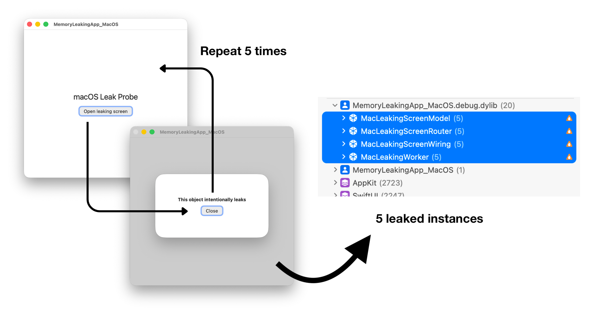

# Detecting memory leaks with UI tests and xctrace



The easiest way I know to make a memory leak obvious is to repeat the same flow five times.

Open a screen. Close it. Do that five times. If the screen is released correctly, its old instances should be gone. If five screens, models, or coordinators remain in memory, there is a clear pattern to investigate.

This also works as an automated check. A UI test repeats the flow while `xctrace` records the app with the Leaks instrument. After the test, a script exports the detected leaks as XML and checks the result.

A lifecycle unit test is useful when I want to check one object in isolation. The UI-test approach covers something different: leaks caused by the way the real app connects screens, models, callbacks, and navigation.

## Repeat the flow with a UI test

The UI test does not inspect memory. It only drives the app and repeats the flow enough times to make a leak easy to spot.

```swift
import XCTest

final class MemoryLeakUITests: XCTestCase {
    @MainActor
    func testDetailsFlowRepeatedly() {
        let app = XCUIApplication()
        app.launch()
        defer { app.terminate() }

        sleep(5) // Time for xctrace to attach.

        for iteration in 1...5 {
            app.buttons["open-details"].tap()

            let closeButton = app.buttons["close-details"]
            XCTAssertTrue(
                closeButton.waitForExistence(timeout: 10),
                "Details did not open on iteration \(iteration)"
            )
            closeButton.tap()
            XCTAssertTrue(closeButton.waitForNonExistence(timeout: 10))
        }

        sleep(5) // Time for the Leaks instrument to inspect the final state.
    }
}
```

The first delay gives `xctrace` time to attach after the app starts. The last delay gives the Leaks instrument time to inspect the final state before the app exits.

## Record the app with xctrace

A script starts the test, waits for the app process, and attaches `xctrace` using the Leaks template. The important part of the recording command looks like this:

```sh
xcrun xctrace record \
  --template 'Leaks' \
  --device "$DEVICE_ID" \
  --attach "$APP_PID" \
  --output LeakRun.trace \
  --no-prompt
```

The test then opens and closes the details screen five times while the app is being recorded.

[Watch the macOS leak-check recording](info/option2_macos.mp4).

[Watch the iOS leak-check recording](info/option2_ios.mp4).

> **iOS device required:** In my testing, recording works on a physical device. On the Simulator, `xctrace record` hangs when it attaches to the app's internal Simulator PID. This looks like an `xctrace` or Simulator bug, but I have not confirmed the cause. If you find a workaround, [email me](mailto:ondrej@macoszek.cz). I would be glad to hear about it.

## Export the detected leaks

The recording produces a `.trace` bundle. `xctrace export` can list its available tracks and export the Leaks table as XML:

```sh
xcrun xctrace export \
  --input LeakRun.trace \
  --toc \
  --output LeakRun-toc.xml

xcrun xctrace export \
  --input LeakRun.trace \
  --xpath '/trace-toc/run[@number="1"]/tracks/track[@name="Leaks"]/details/detail[@name="Leaks"]' \
  --output LeakRun-leaks.xml
```

The table of contents is useful when the trace layout changes or I need to find a different table. The XPath above selects the Leaks table from the first run. The [`xctrace` man page](https://keith.github.io/xcode-man-pages/xctrace.1.html) lists the other recording and export options.

The exported XML is simple enough to read in a small script. If the script finds an unexpected leak, it exits with a failure and CI reports the job as failed.

I keep both the XML and the original `.trace` bundle as CI artifacts. The XML explains why the check failed. The trace can be opened in Instruments to inspect the leaked object and its allocation history.

## Why xctrace makes this easier

I used a similar setup in my [2019 post about finding memory leaks with UI tests](https://ondrej.macoszek.cz/blog/2019-02-27-memleaks-via-uitests/). It relied on the old `instruments` command and [TraceUtility](https://github.com/Qusic/TraceUtility), which guessed Apple's private trace types. [Xcode 13](https://developer.apple.com/documentation/xcode-release-notes/xcode-13-release-notes) replaced `instruments` with `xctrace`, and `xctrace export` can now read the Leaks table directly. There is no need to reverse-engineer the `.trace` format.

## What's in this repository

This repository contains iOS and macOS apps, the repeated UI test, a recording script, an XML checker, and a smaller Leaks trace template. It includes a leak that only appears when the app connects a screen to its dependencies.
